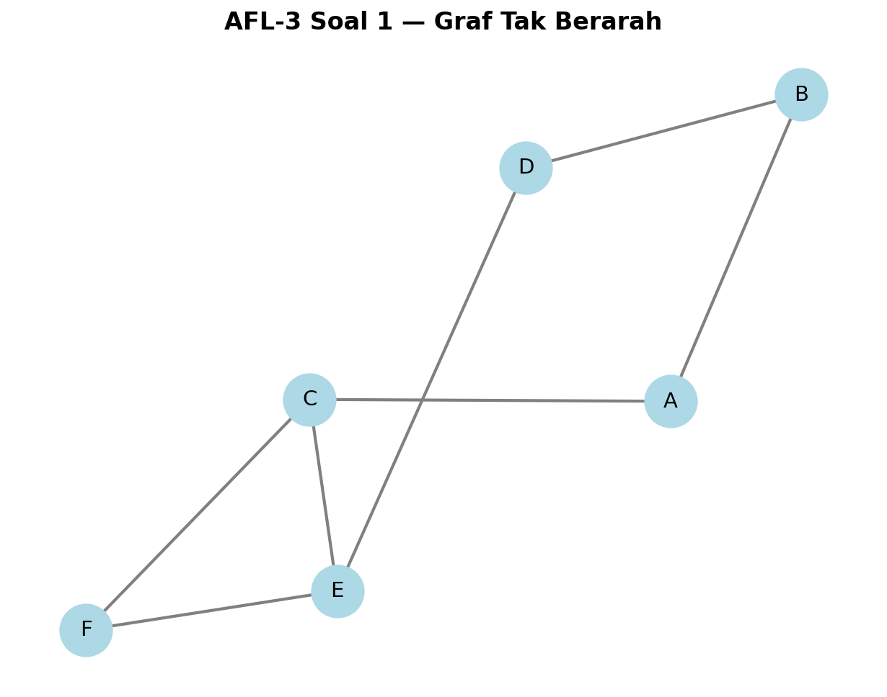
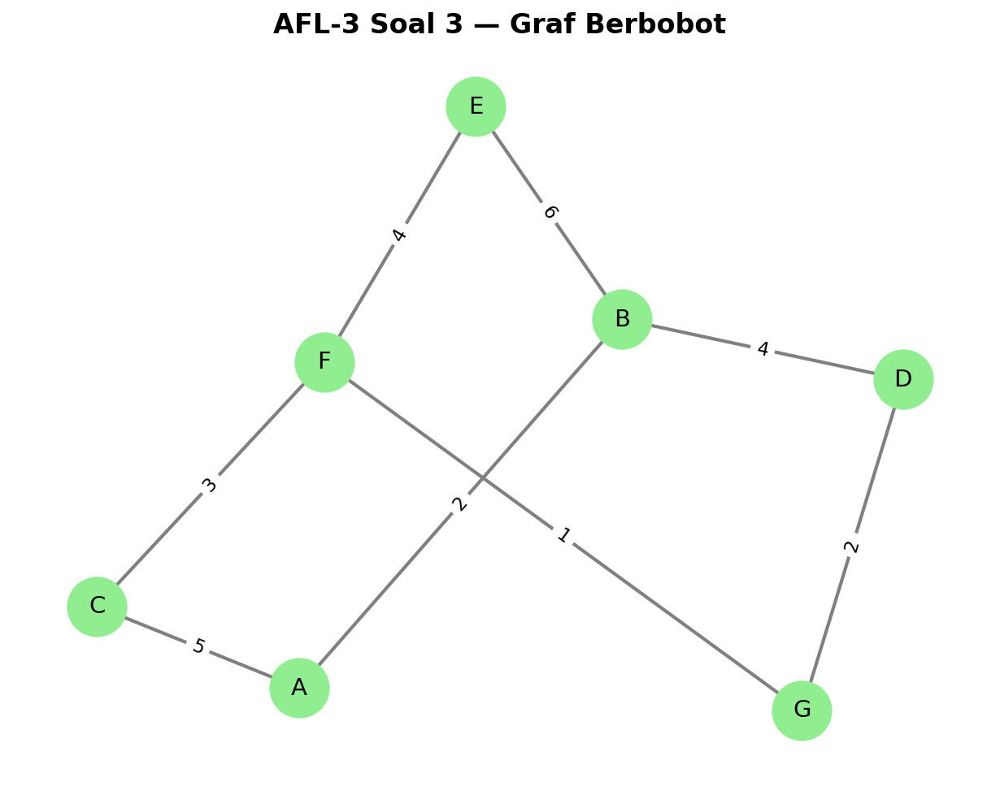
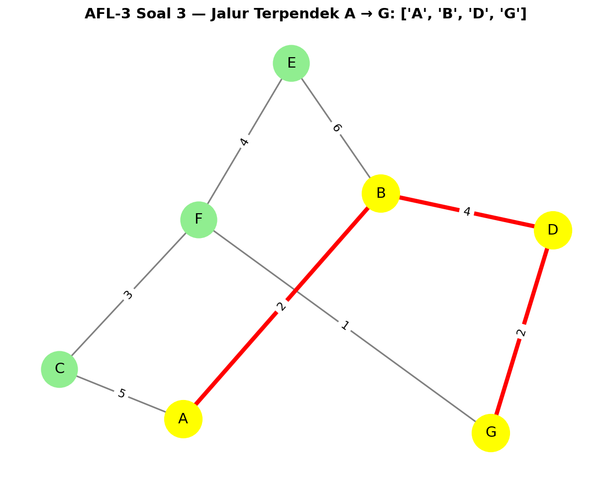

# Implementasi Teori Graf Menggunakan Python

[](https://www.python.org/)
[](https://networkx.org/)
[](https://matplotlib.org/)


## Overview
Project ini merupakan implementasi teori graf dalam Python untuk keperluan pembelajaran Matematika Diskrit. Beberapa operasi dari teori graf telah diubah menjadi *methods* yang dapat digunakan untuk melakukan berbagai operasi dalam teori graf. Semua *method* ini digabung dalam sebuah class `Graf` yang menggunakan library **NetworkX** dan **Matplotlib**.

## Class Methods

### `__init__`
Inisialisasi objek Graf. Dapat membuat graf berarah (directed) atau tak-berarah (undirected).
```python
# Graf tak berarah (default)
graph = Graf()

# Graf berarah
graph_directed = Graf(directed=True)
```

### `add_node`
Menambah sebuah simpul (node/vertex) ke dalam graf. Semua simpul **harus dalam tipe data yang sama** agar bekerja dengan baik.
```python
graph = Graf()

# Nodes huruf
graph.add_node('A')
graph.add_node('B')
graph.add_node('C')
```

### `add_nodes`
Menambah banyak simpul sekaligus dari list atau iterable.
```python
graph = Graf()
vertices = ['A', 'B', 'C', 'D', 'E', 'F']
graph.add_nodes(vertices)
```

### `add_edge`
Menambahkan sisi (edge) antara dua simpul. Bisa menambahkan bobot/jarak dengan parameter `weight`.
```python
# Edge tanpa bobot
graph.add_edge('A', 'B')
graph.add_edge('A', 'C')

# Edge dengan bobot
graph.add_edge('A', 'B', weight=4.5)
graph.add_edge('B', 'C', weight=3.2)
```

### `visualize_graph`
Menggambarkan visualisasi graf menggunakan Matplotlib. Dapat menampilkan label simpul dan bobot sisi.
```python
graph.visualize_graph()
# Dengan custom layout
graph.visualize_graph(layout='circular')
```

> [!NOTE]
> Layout yang tersedia: `spring` (default), `circular`, `kamada_kawai`, `shell`.

### `shortest_path`
Menentukan jalur terpendek dari simpul awal ke simpul tujuan (berdasarkan bobot).
```python
path = graph.shortest_path('A', 'G')
print(path)  # ['A', 'B', 'D', 'G']
```

### `shortest_path_length`
Menghitung total jarak/bobot jalur terpendek.
```python
distance = graph.shortest_path_length('A', 'G')
print(distance)  # 8.0
```

### `visual_shortest_path`
Visualisasi graf dengan jalur terpendek yang disorot.
```python
graph.visual_shortest_path('A', 'G')
```

### `degree`
Mendapatkan derajat simpul (jumlah sisi yang terhubung).
```python
# Derajat satu simpul
deg = graph.degree('A')

# Derajat semua simpul
all_degrees = graph.degree()
```

### `is_connected`
Mengecek apakah semua simpul dalam graf saling terhubung.
```python
connected = graph.is_connected()
print(connected)  # True/False
```

### `has_cycle`
Mengecek apakah graf memiliki siklus (cycle/loop).
```python
has_cycle = graph.has_cycle()
print(has_cycle)  # True/False
```

### `cycles`
Mendapatkan semua siklus dalam graf.
```python
all_cycles = graph.cycles()
for cycle in all_cycles:
    print(cycle)
```

### `bfs_order`
Breadth-First Search dengan urutan tetangga yang deterministik (bisa diurutkan alfabet).
```python
bfs_result = graph.bfs_order('A', sort_neighbors=True)
print(' -> '.join(bfs_result))
```

### `dfs_recursive`
Depth-First Search secara rekursif dengan urutan tetangga yang deterministik.
```python
dfs_result = graph.dfs_recursive('A', sort_neighbors=True)
print(' -> '.join(dfs_result))
```

### `dijkstra_distances`
Algoritma Dijkstra untuk mencari jarak terpendek dari satu simpul ke semua simpul lain.
```python
distances = graph.dijkstra_distances('A')
for vertex, dist in sorted(distances.items()):
    print(f"A -> {vertex}: {dist}")
```

### `dijkstra_path`
Mendapatkan jalur terpendek menggunakan algoritma Dijkstra.
```python
path = graph.dijkstra_path('A', 'G')
print(path)  # ['A', 'B', 'D', 'G']
```

### Metode Tambahan Lainnya
- `has_path(u, v)` — Cek keberadaan jalur antara dua simpul
- `minimum_spanning_tree()` — Mendapatkan Minimum Spanning Tree
- `betweenness_centrality()` — Menghitung betweenness centrality
- `is_bipartite()` — Cek apakah graf bipartite
- `adjacency_matrix()` — Mendapatkan matriks adjacency

> [!TIP]
> Lihat dokumentasi lengkap di dalam file `graf.py` untuk parameter dan penggunaan detail setiap method.

## Installation

> [!IMPORTANT]
> Pastikan Python 3.8+ sudah terinstall di sistem Anda.

```bash
python3 -m venv .venv
. .venv/bin/activate
pip install -r requirements.txt
```

Atau install manual:
```bash
pip install networkx matplotlib
```

> [!TIP]
> Gunakan virtual environment untuk menghindari konflik dependency dengan project lain.

## Cara Pakai

Jalankan contoh program:
```bash
.venv/bin/python main.py
```

> [!NOTE]
> File `main.py` berisi contoh penggunaan class `Graf` untuk berbagai operasi graf.

## Hasil Penyelesaian AFL-3

> [!NOTE]
> Berikut adalah hasil penyelesaian soal AFL-3 menggunakan class `Graf` yang telah dibuat.

### Soal 1 — Graf Tak Berarah, Derajat, dan Konektivitas

**Visualisasi Graf:**



**Hasil Output:**
```
============================================================
AFL-3 SOAL 1 — Graf Tak Berarah, Derajat, dan Konektivitas
============================================================

b) Derajat setiap simpul:
   A: 2
   B: 2
   C: 3
   D: 2
   E: 3
   F: 2

c) Apakah graf memiliki cycle?
   True
   Contoh cycle (cycle basis):
     - ['E', 'C', 'F']
     - ['E', 'D', 'B', 'A', 'C']

d) Apakah graf terhubung (connected)?
   True
============================================================
```

---

### Soal 3 — BFS, DFS, dan Dijkstra

**Visualisasi Graf:**



**Jalur Terpendek A → G:**



**Hasil Output:**
```
============================================================
AFL-3 SOAL 3 — BFS, DFS, dan Dijkstra
============================================================

b) Urutan BFS dari A (tetangga diurutkan alfabet):
   A -> B -> C -> D -> E -> F -> G

c) Urutan DFS rekursif dari A (tetangga diurutkan alfabet):
   A -> B -> D -> G -> F -> C -> E

d) Algoritma Dijkstra dari A:
   1. Jarak minimum dari A ke seluruh simpul:
      A -> A: 0
      A -> B: 2
      A -> C: 5
      A -> D: 6
      A -> E: 8
      A -> F: 8
      A -> G: 8

   2. Jalur terpendek dari A ke G:
      Jalur: A -> B -> D -> G
      Total bobot: 8
============================================================
```

---

## Generate Ulang Visualisasi

Untuk generate ulang gambar visualisasi graf:

```bash
.venv/bin/python afl3/generate_images.py
```

> [!WARNING]
> Pastikan virtual environment sudah aktif sebelum menjalankan script.

---

## Anggota Kelompok

M. Rifki Paranrengi

---


